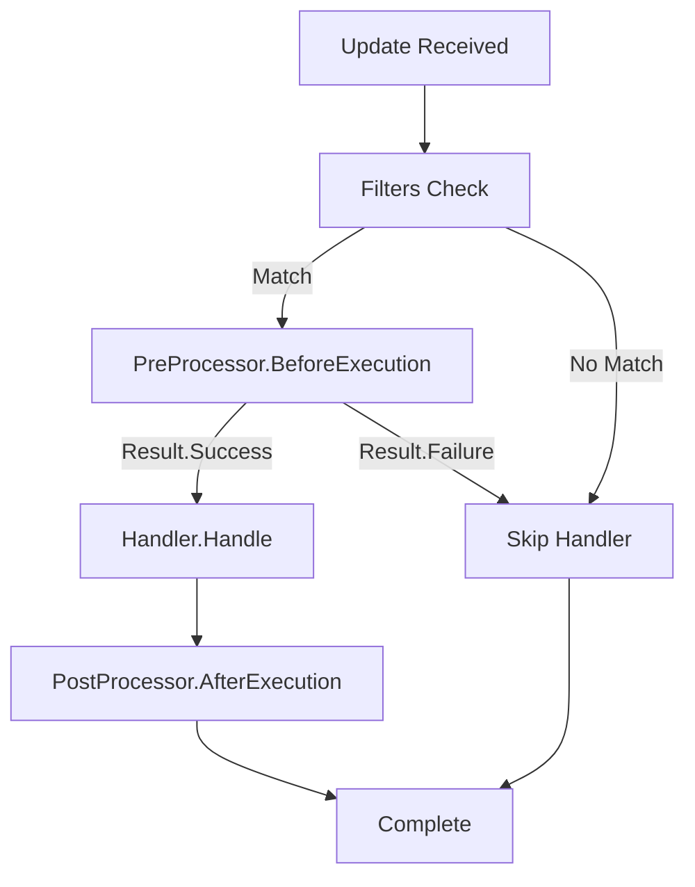

## Overview

The `IPostProcessor` interface enables you to implement cross-cutting concerns that execute after your handler's main logic. Use postprocessors for logging, cleanup operations, metrics collection, audit trails, and other post-execution tasks.

## Interface Definition

```csharp
namespace Telegrator.Aspects
{
    public interface IPostProcessor
    {
        Task<Result> AfterExecution(
            IHandlerContainer container,
            CancellationToken cancellationToken
        );
    }
}
```

## Methods

<ParamField path="AfterExecution(IHandlerContainer container, CancellationToken cancellationToken)" type="Task<Result>">
  Executes after the handler's main execution logic completes.
  
  **Parameters:**
  - `container` (IHandlerContainer): The handler container containing the current update and context
  - `cancellationToken` (CancellationToken): Cancellation token for async operations
  
  **Returns:** A `Result` indicating the final execution result
</ParamField>

## Usage

Implement `IPostProcessor` in a class and apply it to handlers using the `AfterExecutionAttribute`.

### Basic Example

```csharp
using Telegrator.Aspects;
using Telegrator.Handlers.Components;
using Telegram.Bot;

// 1. Implement IPostProcessor
public class LoggingPostProcessor : IPostProcessor
{
    public async Task<Result> AfterExecution(
        IHandlerContainer container,
        CancellationToken cancellationToken)
    {
        var update = container.HandlingUpdate;
        var userId = update.Message?.From?.Id ?? 0;
        
        Console.WriteLine($"[{DateTime.UtcNow}] Handler completed for user {userId}");
        
        await Task.CompletedTask;
        return Result.Success;
    }
}

// 2. Apply to handler using AfterExecutionAttribute
[AfterExecution<LoggingPostProcessor>]
[Command("process")]
public class ProcessHandler : IHandler
{
    public async Task<Result> Handle(
        IHandlerContainer container,
        CancellationToken cancellationToken)
    {
        var bot = container.Client;
        var chatId = container.HandlingUpdate.Message!.Chat.Id;
        
        await bot.SendTextMessageAsync(
            chatId,
            "Processing...",
            cancellationToken: cancellationToken
        );
        
        return Result.Success;
    }
}
```

## AfterExecutionAttribute\<T\>

Attribute that specifies a post-execution processor for a handler.

### Type Parameters

<ParamField path="T" type="type parameter">
  The type of the post-processor that implements `IPostProcessor`.
</ParamField>

### Properties

<ParamField path="ProcessorType" type="Type">
  Gets the type of the post-processor (readonly).
</ParamField>

### Usage

```csharp
[AttributeUsage(AttributeTargets.Class, AllowMultiple = false)]
public class AfterExecutionAttribute<T> : Attribute where T : IPostProcessor
{
    public Type ProcessorType => typeof(T);
}
```

<Note>
  The attribute can only be applied to classes (handlers) and cannot be used multiple times on the same handler.
</Note>

## Common Use Cases

### Audit Logging

```csharp
public class AuditLogPostProcessor : IPostProcessor
{
    private readonly IAuditLogger _auditLogger;
    
    public AuditLogPostProcessor(IAuditLogger auditLogger)
    {
        _auditLogger = auditLogger;
    }
    
    public async Task<Result> AfterExecution(
        IHandlerContainer container,
        CancellationToken cancellationToken)
    {
        var update = container.HandlingUpdate;
        var userId = update.Message?.From?.Id ?? 0;
        var username = update.Message?.From?.Username ?? "unknown";
        var command = update.Message?.Text ?? "";
        
        await _auditLogger.LogAsync(new AuditEntry
        {
            UserId = userId,
            Username = username,
            Action = command,
            Timestamp = DateTime.UtcNow,
            Success = true
        }, cancellationToken);
        
        return Result.Success;
    }
}

[AfterExecution<AuditLogPostProcessor>]
[Command("delete")]
public class DeleteHandler : IHandler
{
    public async Task<Result> Handle(
        IHandlerContainer container,
        CancellationToken cancellationToken)
    {
        // Perform deletion
        // ...
        
        // AuditLogPostProcessor will log this action
        return Result.Success;
    }
}
```

### Performance Metrics

```csharp
public class PerformanceMetricsPostProcessor : IPostProcessor
{
    private readonly IMetricsCollector _metrics;
    private readonly Dictionary<int, DateTime> _startTimes = new();
    
    public PerformanceMetricsPostProcessor(IMetricsCollector metrics)
    {
        _metrics = metrics;
    }
    
    public async Task<Result> AfterExecution(
        IHandlerContainer container,
        CancellationToken cancellationToken)
    {
        var updateId = container.HandlingUpdate.Id;
        
        if (_startTimes.TryGetValue(updateId, out var startTime))
        {
            var duration = DateTime.UtcNow - startTime;
            
            await _metrics.RecordAsync(new
            {
                HandlerType = container.GetType().Name,
                Duration = duration.TotalMilliseconds,
                UpdateType = container.HandlingUpdate.Type
            }, cancellationToken);
            
            _startTimes.Remove(updateId);
        }
        
        return Result.Success;
    }
}

[AfterExecution<PerformanceMetricsPostProcessor>]
[Command("search")]
public class SearchHandler : IHandler
{
    public async Task<Result> Handle(
        IHandlerContainer container,
        CancellationToken cancellationToken)
    {
        // Heavy search operation
        // Execution time will be tracked
        return Result.Success;
    }
}
```

### Cleanup Operations

```csharp
public class TempFileCleanupPostProcessor : IPostProcessor
{
    public async Task<Result> AfterExecution(
        IHandlerContainer container,
        CancellationToken cancellationToken)
    {
        var userId = container.HandlingUpdate.Message?.From?.Id ?? 0;
        var tempDir = Path.Combine(Path.GetTempPath(), $"bot_user_{userId}");
        
        if (Directory.Exists(tempDir))
        {
            try
            {
                Directory.Delete(tempDir, recursive: true);
                Console.WriteLine($"Cleaned up temp files for user {userId}");
            }
            catch (Exception ex)
            {
                Console.WriteLine($"Failed to clean up temp files: {ex.Message}");
            }
        }
        
        await Task.CompletedTask;
        return Result.Success;
    }
}

[AfterExecution<TempFileCleanupPostProcessor>]
[Command("process_image")]
public class ImageProcessHandler : IHandler
{
    public async Task<Result> Handle(
        IHandlerContainer container,
        CancellationToken cancellationToken)
    {
        // Process image and create temp files
        // Cleanup will happen automatically after
        return Result.Success;
    }
}
```

### State Cleanup

```csharp
public class StateCleanupPostProcessor : IPostProcessor
{
    public async Task<Result> AfterExecution(
        IHandlerContainer container,
        CancellationToken cancellationToken)
    {
        // Clean up any conversation states after completion
        container.DeleteNumericState();
        container.DeleteStringState();
        
        var bot = container.Client;
        var chatId = container.HandlingUpdate.Message!.Chat.Id;
        
        await bot.SendTextMessageAsync(
            chatId,
            "Session completed and cleaned up.",
            cancellationToken: cancellationToken
        );
        
        return Result.Success;
    }
}

[AfterExecution<StateCleanupPostProcessor>]
[Command("complete")]
public class CompleteRegistrationHandler : IHandler
{
    public async Task<Result> Handle(
        IHandlerContainer container,
        CancellationToken cancellationToken)
    {
        // Complete the registration flow
        // States will be cleaned up automatically
        return Result.Success;
    }
}
```

### Notification System

```csharp
public class AdminNotificationPostProcessor : IPostProcessor
{
    private readonly ITelegramBotClient _bot;
    private readonly long _adminChatId;
    
    public AdminNotificationPostProcessor(ITelegramBotClient bot, IConfiguration config)
    {
        _bot = bot;
        _adminChatId = long.Parse(config["AdminChatId"] ?? "0");
    }
    
    public async Task<Result> AfterExecution(
        IHandlerContainer container,
        CancellationToken cancellationToken)
    {
        var update = container.HandlingUpdate;
        var userId = update.Message?.From?.Id ?? 0;
        var username = update.Message?.From?.Username ?? "unknown";
        var action = update.Message?.Text ?? "unknown action";
        
        await _bot.SendTextMessageAsync(
            _adminChatId,
            $"User @{username} ({userId}) performed: {action}",
            cancellationToken: cancellationToken
        );
        
        return Result.Success;
    }
}

[AfterExecution<AdminNotificationPostProcessor>]
[Command("report")]
public class ReportHandler : IHandler
{
    public async Task<Result> Handle(
        IHandlerContainer container,
        CancellationToken cancellationToken)
    {
        // Handle report
        // Admin will be notified automatically
        return Result.Success;
    }
}
```

## Execution Flow

When a handler has both preprocessor and postprocessor:

1. Update matches handler's filters
2. Preprocessor executes (`BeforeExecution`)
3. If preprocessor returns `Result.Success`, handler executes
4. **Postprocessor executes** (`AfterExecution`)
5. Complete



<Note>
  Postprocessors execute even if the handler returns `Result.Failure`, but they do NOT execute if the preprocessor stops execution.
</Note>

## Return Values

<ParamField path="Result.Success" type="Result">
  Indicates the postprocessor completed successfully.
</ParamField>

<ParamField path="Result.Failure" type="Result">
  Indicates the postprocessor encountered an error. This does not affect the handler's execution (which already completed).
</ParamField>

## Error Handling

Postprocessors should handle their own errors gracefully:

```csharp
public class SafeLoggingPostProcessor : IPostProcessor
{
    private readonly ILogger _logger;
    
    public SafeLoggingPostProcessor(ILogger logger)
    {
        _logger = logger;
    }
    
    public async Task<Result> AfterExecution(
        IHandlerContainer container,
        CancellationToken cancellationToken)
    {
        try
        {
            // Attempt to log
            await LogToExternalServiceAsync(container.HandlingUpdate, cancellationToken);
            return Result.Success;
        }
        catch (Exception ex)
        {
            // Don't let logging failures break the handler
            _logger.LogError(ex, "Failed to log to external service");
            return Result.Success; // Or Result.Failure if you want to track this
        }
    }
    
    private async Task LogToExternalServiceAsync(Update update, CancellationToken cancellationToken)
    {
        // External logging implementation
        await Task.CompletedTask;
    }
}
```

## Combining Pre and Post Processors

```csharp
// Authorization before execution
public class AuthorizationPreProcessor : IPreProcessor
{
    public async Task<Result> BeforeExecution(
        IHandlerContainer container,
        CancellationToken cancellationToken = default)
    {
        // Check authorization
        var isAuthorized = await CheckAuthorizationAsync(container.HandlingUpdate);
        return isAuthorized ? Result.Success : Result.Failure;
    }
}

// Audit logging after execution
public class AuditPostProcessor : IPostProcessor
{
    public async Task<Result> AfterExecution(
        IHandlerContainer container,
        CancellationToken cancellationToken)
    {
        // Log the action
        await LogAuditTrailAsync(container.HandlingUpdate);
        return Result.Success;
    }
}

// Apply both
[BeforeExecution<AuthorizationPreProcessor>]
[AfterExecution<AuditPostProcessor>]
[Command("admin_action")]
public class AdminActionHandler : IHandler
{
    public async Task<Result> Handle(
        IHandlerContainer container,
        CancellationToken cancellationToken)
    {
        // Main handler logic
        // Only executes if authorized
        // Always logged to audit trail
        return Result.Success;
    }
}
```

## Dependency Injection

Postprocessors can receive dependencies through constructor injection:

```csharp
public class DatabaseLoggingPostProcessor : IPostProcessor
{
    private readonly IDbContext _dbContext;
    private readonly ILogger<DatabaseLoggingPostProcessor> _logger;
    
    public DatabaseLoggingPostProcessor(
        IDbContext dbContext,
        ILogger<DatabaseLoggingPostProcessor> logger)
    {
        _dbContext = dbContext;
        _logger = logger;
    }
    
    public async Task<Result> AfterExecution(
        IHandlerContainer container,
        CancellationToken cancellationToken)
    {
        try
        {
            var logEntry = new HandlerLog
            {
                UpdateId = container.HandlingUpdate.Id,
                UserId = container.HandlingUpdate.Message?.From?.Id ?? 0,
                Timestamp = DateTime.UtcNow,
                HandlerType = container.GetType().Name
            };
            
            _dbContext.HandlerLogs.Add(logEntry);
            await _dbContext.SaveChangesAsync(cancellationToken);
            
            return Result.Success;
        }
        catch (Exception ex)
        {
            _logger.LogError(ex, "Failed to save handler log");
            return Result.Failure;
        }
    }
}
```

## Best Practices

1. **Keep Postprocessors Focused**: Each postprocessor should have a single responsibility (logging, cleanup, metrics, etc.)

2. **Handle Errors Gracefully**: Don't let postprocessor failures break the user experience:
   ```csharp
   try
   {
       await DoCleanupAsync();
   }
   catch (Exception ex)
   {
       _logger.LogError(ex, "Cleanup failed");
       // Continue anyway
   }
   return Result.Success;
   ```

3. **Use Async Operations**: Postprocessors support async/await for database operations, API calls, etc.

4. **Don't Modify Handler State**: Postprocessors should observe and log, not change handler behavior

5. **Consider Performance**: Postprocessors add overhead to every handler execution. Keep them lightweight.

6. **Use for Side Effects**: Perfect for operations that should happen regardless of handler success/failure

## Limitations

<Warning>
  - Only **one** postprocessor can be applied per handler (AllowMultiple = false)
  - Postprocessors can only be applied to handler classes, not individual methods
  - Postprocessors do NOT execute if the preprocessor stops execution
  - If you need multiple post-execution tasks, combine them in a single postprocessor
</Warning>

## See Also

- [IPreProcessor](/api/aspects/preprocessor) - Execute logic before handler execution
- [Filters](/api/filters) - Filter which updates reach handlers
- [Handlers](/api/handlers) - Core handler documentation