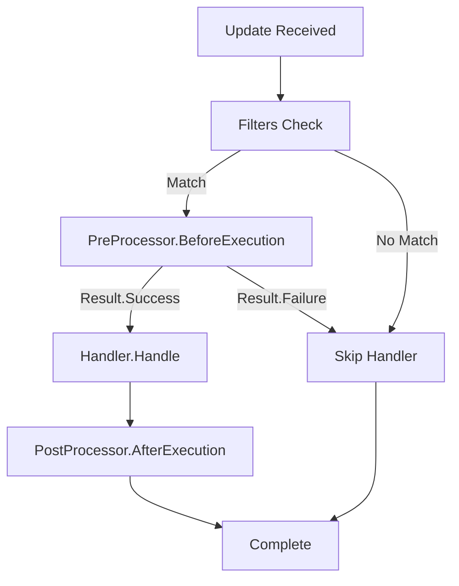

## Overview

The `IPreProcessor` interface enables you to implement cross-cutting concerns that execute before your handler's main logic. Use preprocessors for validation, logging, authorization, rate limiting, and other pre-execution checks.

## Interface Definition

```csharp
namespace Telegrator.Aspects
{
    public interface IPreProcessor
    {
        Task<Result> BeforeExecution(
            IHandlerContainer container,
            CancellationToken cancellationToken = default
        );
    }
}
```

## Methods

<ParamField path="BeforeExecution(IHandlerContainer container, CancellationToken cancellationToken)" type="Task<Result>">
  Executes before the handler's main execution logic.
  
  **Parameters:**
  - `container` (IHandlerContainer): The handler container containing the current update and context
  - `cancellationToken` (CancellationToken): Optional cancellation token for async operations
  
  **Returns:** A `Result` indicating whether execution should continue (`Result.Success`) or stop (`Result.Failure`)
</ParamField>

## Usage

Implement `IPreProcessor` in a class and apply it to handlers using the `BeforeExecutionAttribute`.

### Basic Example

```csharp
using Telegrator.Aspects;
using Telegrator.Handlers.Components;
using Telegram.Bot;

// 1. Implement IPreProcessor
public class LoggingPreProcessor : IPreProcessor
{
    public async Task<Result> BeforeExecution(
        IHandlerContainer container,
        CancellationToken cancellationToken = default)
    {
        var update = container.HandlingUpdate;
        var userId = update.Message?.From?.Id ?? 0;
        
        Console.WriteLine($"[{DateTime.UtcNow}] User {userId} triggered handler");
        
        // Continue execution
        return Result.Success;
    }
}

// 2. Apply to handler using BeforeExecutionAttribute
[BeforeExecution<LoggingPreProcessor>]
[Command("start")]
public class StartHandler : IHandler
{
    public async Task<Result> Handle(
        IHandlerContainer container,
        CancellationToken cancellationToken)
    {
        var bot = container.Client;
        var chatId = container.HandlingUpdate.Message!.Chat.Id;
        
        await bot.SendTextMessageAsync(
            chatId,
            "Welcome!",
            cancellationToken: cancellationToken
        );
        
        return Result.Success;
    }
}
```

## BeforeExecutionAttribute\<T\>

Attribute that specifies a pre-execution processor for a handler.

### Type Parameters

<ParamField path="T" type="type parameter">
  The type of the pre-processor that implements `IPreProcessor`.
</ParamField>

### Properties

<ParamField path="ProcessorType" type="Type">
  Gets the type of the pre-processor (readonly).
</ParamField>

### Usage

```csharp
[AttributeUsage(AttributeTargets.Class, AllowMultiple = false)]
public class BeforeExecutionAttribute<T> : Attribute where T : IPreProcessor
{
    public Type ProcessorType => typeof(T);
}
```

<Note>
  The attribute can only be applied to classes (handlers) and cannot be used multiple times on the same handler.
</Note>

## Common Use Cases

### Authorization Check

```csharp
public class AdminAuthorizationPreProcessor : IPreProcessor
{
    private readonly HashSet<long> _adminUserIds = new()
    {
        123456789,
        987654321
    };
    
    public async Task<Result> BeforeExecution(
        IHandlerContainer container,
        CancellationToken cancellationToken = default)
    {
        var userId = container.HandlingUpdate.Message?.From?.Id;
        
        if (userId == null || !_adminUserIds.Contains(userId.Value))
        {
            var bot = container.Client;
            var chatId = container.HandlingUpdate.Message!.Chat.Id;
            
            await bot.SendTextMessageAsync(
                chatId,
                "You are not authorized to use this command.",
                cancellationToken: cancellationToken
            );
            
            // Stop execution
            return Result.Failure;
        }
        
        // Continue execution
        return Result.Success;
    }
}

[BeforeExecution<AdminAuthorizationPreProcessor>]
[Command("admin")]
public class AdminPanelHandler : IHandler
{
    public async Task<Result> Handle(
        IHandlerContainer container,
        CancellationToken cancellationToken)
    {
        // This only executes if authorization passed
        // ...
        return Result.Success;
    }
}
```

### Rate Limiting

```csharp
public class RateLimitPreProcessor : IPreProcessor
{
    private readonly Dictionary<long, DateTime> _lastRequestTime = new();
    private readonly TimeSpan _cooldownPeriod = TimeSpan.FromSeconds(5);
    
    public async Task<Result> BeforeExecution(
        IHandlerContainer container,
        CancellationToken cancellationToken = default)
    {
        var userId = container.HandlingUpdate.Message?.From?.Id ?? 0;
        var now = DateTime.UtcNow;
        
        if (_lastRequestTime.TryGetValue(userId, out var lastTime))
        {
            var timeSinceLastRequest = now - lastTime;
            if (timeSinceLastRequest < _cooldownPeriod)
            {
                var bot = container.Client;
                var chatId = container.HandlingUpdate.Message!.Chat.Id;
                var remainingSeconds = (_cooldownPeriod - timeSinceLastRequest).Seconds;
                
                await bot.SendTextMessageAsync(
                    chatId,
                    $"Please wait {remainingSeconds} seconds before using this command again.",
                    cancellationToken: cancellationToken
                );
                
                return Result.Failure;
            }
        }
        
        _lastRequestTime[userId] = now;
        return Result.Success;
    }
}

[BeforeExecution<RateLimitPreProcessor>]
[Command("search")]
public class SearchHandler : IHandler
{
    // Heavy operation that needs rate limiting
    public async Task<Result> Handle(
        IHandlerContainer container,
        CancellationToken cancellationToken)
    {
        // ...
        return Result.Success;
    }
}
```

### Input Validation

```csharp
public class TextMessageValidationPreProcessor : IPreProcessor
{
    public async Task<Result> BeforeExecution(
        IHandlerContainer container,
        CancellationToken cancellationToken = default)
    {
        var message = container.HandlingUpdate.Message;
        
        if (message == null || string.IsNullOrWhiteSpace(message.Text))
        {
            var bot = container.Client;
            var chatId = message?.Chat.Id ?? 0;
            
            await bot.SendTextMessageAsync(
                chatId,
                "Please send a text message.",
                cancellationToken: cancellationToken
            );
            
            return Result.Failure;
        }
        
        return Result.Success;
    }
}

[BeforeExecution<TextMessageValidationPreProcessor>]
[Message]
public class ProcessTextHandler : IHandler
{
    public async Task<Result> Handle(
        IHandlerContainer container,
        CancellationToken cancellationToken)
    {
        // We know message.Text is not null here
        var text = container.HandlingUpdate.Message!.Text!;
        // ...
        return Result.Success;
    }
}
```

### Metrics Collection

```csharp
public class MetricsPreProcessor : IPreProcessor
{
    public async Task<Result> BeforeExecution(
        IHandlerContainer container,
        CancellationToken cancellationToken = default)
    {
        var update = container.HandlingUpdate;
        
        // Log metrics
        var userId = update.Message?.From?.Id ?? 0;
        var updateType = update.Type;
        var timestamp = DateTime.UtcNow;
        
        // Send to your metrics system
        await LogMetricsAsync(new
        {
            UserId = userId,
            UpdateType = updateType,
            Timestamp = timestamp,
            HandlerType = "CommandHandler"
        });
        
        return Result.Success;
    }
    
    private async Task LogMetricsAsync(object metrics)
    {
        // Your metrics logging implementation
        await Task.CompletedTask;
    }
}
```

## Execution Flow

When a handler has a preprocessor:

1. Update matches handler's filters
2. **Preprocessor executes** (`BeforeExecution` is called)
3. If preprocessor returns `Result.Success`, handler executes
4. If preprocessor returns `Result.Failure`, handler is skipped
5. If handler has a postprocessor, it executes after



## Return Values

<ParamField path="Result.Success" type="Result">
  Indicates the preprocessor completed successfully and handler execution should continue.
</ParamField>

<ParamField path="Result.Failure" type="Result">
  Indicates the preprocessor failed or determined the handler should not execute. The handler is skipped.
</ParamField>

## Dependency Injection

If you're using dependency injection, preprocessors can receive dependencies through their constructor:

```csharp
public class DatabaseValidationPreProcessor : IPreProcessor
{
    private readonly IUserRepository _userRepository;
    private readonly ILogger<DatabaseValidationPreProcessor> _logger;
    
    public DatabaseValidationPreProcessor(
        IUserRepository userRepository,
        ILogger<DatabaseValidationPreProcessor> logger)
    {
    _userRepository = userRepository;
        _logger = logger;
    }
    
    public async Task<Result> BeforeExecution(
        IHandlerContainer container,
        CancellationToken cancellationToken = default)
    {
        var userId = container.HandlingUpdate.Message?.From?.Id ?? 0;
        var user = await _userRepository.GetByIdAsync(userId, cancellationToken);
        
        if (user == null || !user.IsActive)
        {
            _logger.LogWarning("Inactive user {UserId} attempted access", userId);
            return Result.Failure;
        }
        
        return Result.Success;
    }
}
```

## Best Practices

1. **Keep Preprocessors Focused**: Each preprocessor should have a single responsibility (authorization, validation, logging, etc.)

2. **Return Result.Failure to Stop Execution**: When validation fails or authorization is denied, return `Result.Failure` to prevent the handler from executing

3. **Use Async Operations**: Preprocessors support async/await for database queries, API calls, etc.

4. **Handle Exceptions**: Wrap risky operations in try-catch blocks:
   ```csharp
   public async Task<Result> BeforeExecution(
       IHandlerContainer container,
       CancellationToken cancellationToken = default)
   {
       try
       {
           // Risky operation
           await ValidateUserAsync(container.HandlingUpdate);
           return Result.Success;
       }
       catch (Exception ex)
       {
           _logger.LogError(ex, "Validation failed");
           return Result.Failure;
       }
   }
   ```

5. **Provide User Feedback**: When stopping execution, send a message explaining why:
   ```csharp
   await bot.SendTextMessageAsync(
       chatId,
       "You must be subscribed to use this feature.",
       cancellationToken: cancellationToken
   );
   return Result.Failure;
   ```

## Limitations

<Warning>
  - Only **one** preprocessor can be applied per handler (AllowMultiple = false)
  - Preprocessors can only be applied to handler classes, not individual methods
  - If you need multiple pre-execution checks, combine them in a single preprocessor
</Warning>

## See Also

- [IPostProcessor](/api/aspects/postprocessor) - Execute logic after handler execution
- [Filters](/api/filters) - Filter which updates reach handlers
- [Handlers](/api/handlers) - Core handler documentation