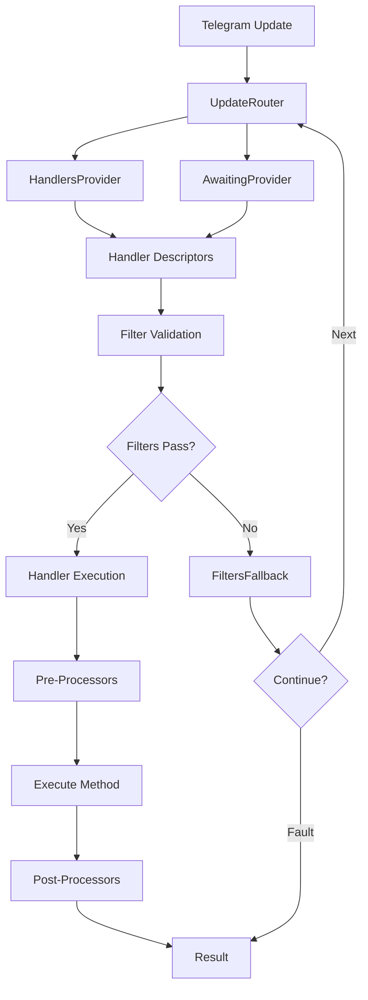

## Framework Design

Telegrator is a mediator-pattern-based framework for building Telegram bots in C#. It follows a clean, modular architecture that separates concerns and provides powerful abstractions for handling Telegram updates.

### Key Components

The framework is built around several core components that work together to process Telegram updates:



### Core Layers

<AccordionGroup>
  <Accordion title="Routing Layer" icon="route">
    The routing layer is responsible for receiving updates from Telegram and directing them to appropriate handlers.

    **Key Classes:**
    - `UpdateRouter` - Main router implementation that manages update distribution
    - `IUpdateRouter` - Interface defining router capabilities
    - `UpdateHandlersPool` - Manages concurrent handler execution

    **Responsibilities:**
    - Receiving updates from Telegram Bot API
    - Finding matching handlers through providers
    - Managing handler execution order and concurrency
    - Exception handling and error routing
  </Accordion>

  <Accordion title="Handler Layer" icon="code">
    The handler layer contains the business logic for processing different types of updates.

    **Base Classes:**
    - `UpdateHandlerBase` - Base for all handlers
    - `MessageHandler` - For message updates
    - `CommandHandler` - For bot commands
    - `CallbackQueryHandler` - For callback queries
    - `InlineQueryHandler` - For inline queries

    **Features:**
    - Type-safe update handling
    - Lifecycle management
    - Result-based control flow
    - Aspect-oriented programming support
  </Accordion>

  <Accordion title="Filter Layer" icon="filter">
    The filter layer provides declarative update filtering through attributes.

    **Common Filters:**
    - Text filters (contains, equals, starts with, ends with)
    - Sender filters (user ID, username, bot/premium)
    - State filters (numeric, string, enum)
    - Command filters (aliases, arguments)

    **Benefits:**
    - Declarative configuration
    - Composable filter chains
    - Reusable filter logic
    - Early rejection of non-matching updates
  </Accordion>

  <Accordion title="State Management" icon="database">
    State management allows tracking conversation state across multiple updates.

    **State Keepers:**
    - `NumericStateKeeper` - Integer-based states
    - `StringStateKeeper` - String-based states
    - `EnumStateKeeper<TEnum>` - Enum-based states

    **Features:**
    - Per-user or per-chat state tracking
    - Automatic state transitions
    - Custom key resolvers
    - Integration with filter system
  </Accordion>
</AccordionGroup>

## Update Processing Flow

When a Telegram update arrives, it goes through the following processing pipeline:

### 1. Update Reception

The `UpdateRouter` receives the update from the Telegram Bot API through either polling or webhooks.

```csharp
public virtual async Task HandleUpdateAsync(
    ITelegramBotClient botClient, 
    Update update, 
    CancellationToken cancellationToken)
{
    // Logging
    LogUpdate(update);
    
    try
    {
        // Check awaiting handlers first
        IEnumerable<DescribedHandlerInfo> handlers = 
            GetHandlers(AwaitingProvider, botClient, update, cancellationToken);
        
        if (handlers.Any())
        {
            await HandlersPool.Enqueue(handlers);
            
            // Check if awaiting handlers have exclusive routing
            if (Options.ExclusiveAwaitingHandlerRouting)
                return;
        }
        
        // Queue regular handlers for execution
        await HandlersPool.Enqueue(
            GetHandlers(HandlersProvider, botClient, update, cancellationToken));
    }
    catch (Exception ex)
    {
        ExceptionHandler?.HandleException(botClient, ex, 
            HandleErrorSource.PollingError, cancellationToken);
    }
}
```

### 2. Handler Discovery

The router queries the `HandlersProvider` and `AwaitingProvider` to find handlers registered for the update type.

<Tip>
  Awaiting handlers are checked first and can optionally block regular handlers through the `ExclusiveAwaitingHandlerRouting` option.
</Tip>

### 3. Filter Validation

Each handler's filters are validated against the update. Only handlers with passing filters proceed to execution.

```csharp
if (descriptor.Filters != null)
{
    FiltersFallbackReport report = new FiltersFallbackReport(descriptor, filterContext);
    Result filtersResult = descriptor.Filters.Validate(
        filterContext, descriptor.FormReport, ref report);
    
    if (filtersResult.RouteNext)
    {
        // Filters failed, call FiltersFallback
        Result fallbackResult = handlerInstance.FiltersFallback(
            report, client, cancellationToken).Result;
        breakRouting = !fallbackResult.RouteNext;
        return null;
    }
}
```

### 4. Handler Execution

Matching handlers are executed through a three-phase process:

1. **Pre-Processing**: Execute aspect-based preprocessors
2. **Main Execution**: Run the handler's `Execute` method
3. **Post-Processing**: Execute aspect-based post-processors

```csharp
// Executing pre processor
if (aspects != null)
{
    Result? preResult = await aspects
        .ExecutePre(this, container, cancellationToken)
        .ConfigureAwait(false);
    
    if (!preResult.Positive)
        return preResult;
}

// Executing handler
Result execResult = await ExecuteInternal(container, cancellationToken)
    .ConfigureAwait(false);

// Executing post processor
if (aspects != null)
{
    Result postResult = await aspects
        .ExecutePost(this, container, cancellationToken)
        .ConfigureAwait(false);
}
```

### 5. Result Handling

Handlers return a `Result` that controls the router's behavior:

- `Result.Ok()` - Handler succeeded, stop routing
- `Result.Next()` - Continue to next matching handler
- `Result.Fault()` - Handler failed, stop routing
- `Result.Next<T>()` - Continue only with handlers of type T

## Configuration Options

The framework provides several configuration options through `TelegratorOptions`:

```csharp
public class TelegratorOptions : ITelegratorOptions
{
    /// <summary>
    /// Maximum number of handlers that can execute in parallel.
    /// Null means unlimited concurrency.
    /// </summary>
    public int? MaximumParallelWorkingHandlers { get; set; }
    
    /// <summary>
    /// If true, regular handlers won't execute when awaiting handlers match.
    /// </summary>
    public bool ExclusiveAwaitingHandlerRouting { get; set; }
    
    /// <summary>
    /// If true, throws exception when command aliases intersect.
    /// </summary>
    public bool ExceptIntersectingCommandAliases { get; set; } = true;
    
    /// <summary>
    /// Global cancellation token for all operations.
    /// </summary>
    public CancellationToken GlobalCancellationToken { get; set; }
}
```

## Design Principles

### Separation of Concerns

Each component has a single, well-defined responsibility:
- Routers handle update distribution
- Handlers contain business logic
- Filters perform validation
- State keepers manage state

### Type Safety

The framework leverages C#'s type system to provide compile-time safety:
- Generic handler base classes
- Strongly-typed filters
- Type-safe state management

### Extensibility

The framework is designed to be extended:
- Custom handlers through base classes
- Custom filters through `IFilter<T>`
- Custom state keepers through `StateKeeperBase<TKey, TState>`
- Custom aspects through `IPreProcessor` and `IPostProcessor`

<Note>
  The mediator pattern allows for clean separation between update reception and handling, making the codebase maintainable and testable.
</Note>

## Next Steps

<CardGroup cols={2}>
  <Card title="Mediator Pattern" icon="shuffle" href="/core-concepts/mediator-pattern">
    Learn about the UpdateRouter and dispatching mechanism
  </Card>
  <Card title="Handlers" icon="code" href="/core-concepts/handlers">
    Explore different handler types and their usage
  </Card>
  <Card title="Filters" icon="filter" href="/core-concepts/filters">
    Master the filter system for update validation
  </Card>
  <Card title="State Management" icon="database" href="/core-concepts/state-management">
    Understand conversation state tracking
  </Card>
</CardGroup>