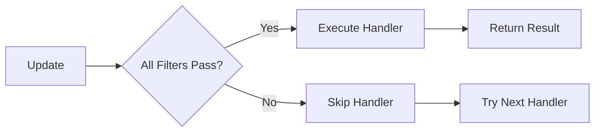

## Overview

Filters are attributes that declaratively specify which updates a handler should process. They provide a clean, readable way to validate updates before handler execution, reducing boilerplate code and improving maintainability.

## How Filters Work

Filters are applied as attributes to handler classes. When an update arrives, the router validates all filters before executing the handler:



## Filter Categories

Telegrator provides several categories of filters:

<CardGroup cols={2}>
  <Card title="Text Filters" icon="font">
    Filter based on message text content
  </Card>
  <Card title="Sender Filters" icon="user">
    Filter based on who sent the message
  </Card>
  <Card title="Command Filters" icon="terminal">
    Filter based on bot commands
  </Card>
  <Card title="State Filters" icon="database">
    Filter based on conversation state
  </Card>
  <Card title="Chat Filters" icon="comments">
    Filter based on chat type and properties
  </Card>
  <Card title="Callback Filters" icon="hand-pointer">
    Filter based on callback query data
  </Card>
</CardGroup>

## Text Filters

Text filters validate message text content.

### TextEquals

Matches messages with exact text:

```csharp
using Telegrator.Handlers;
using Telegrator.Annotations;

[MessageHandler]
[TextEquals("hello", StringComparison.OrdinalIgnoreCase)]
public class HelloHandler : MessageHandler
{
    public override async Task<Result> Execute(
        IHandlerContainer<Message> container, 
        CancellationToken cancellation)
    {
        await Reply("Hello! 👋");
        return Result.Ok();
    }
}
```

### TextStartsWith

Matches messages that start with specific text:

```csharp
[MessageHandler]
[TextStartsWith("show me", StringComparison.InvariantCultureIgnoreCase)]
public class ShowCommandHandler : MessageHandler
{
    public override async Task<Result> Execute(
        IHandlerContainer<Message> container, 
        CancellationToken cancellation)
    {
        string request = Input.Text.Substring(8); // Remove "show me "
        await Reply($"Showing: {request}");
        return Result.Ok();
    }
}
```

### TextEndsWith

Matches messages that end with specific text:

```csharp
[MessageHandler]
[TextEndsWith("?")]
public class QuestionHandler : MessageHandler
{
    public override async Task<Result> Execute(
        IHandlerContainer<Message> container, 
        CancellationToken cancellation)
    {
        await Reply("That's a great question! Let me think...");
        return Result.Ok();
    }
}
```

### TextContains

Matches messages containing specific text:

```csharp
[MessageHandler]
[TextContains("help", StringComparison.OrdinalIgnoreCase)]
public class HelpKeywordHandler : MessageHandler
{
    public override async Task<Result> Execute(
        IHandlerContainer<Message> container, 
        CancellationToken cancellation)
    {
        await Reply("It looks like you need help. Type /help for assistance.");
        return Result.Ok();
    }
}
```

### TextContainsWord

Matches messages containing a specific word (not just substring):

```csharp
[MessageHandler]
[TextContainsWord("urgent", StringComparison.OrdinalIgnoreCase)]
public class UrgentHandler : MessageHandler
{
    public override async Task<Result> Execute(
        IHandlerContainer<Message> container, 
        CancellationToken cancellation)
    {
        // Matches "This is urgent" but not "surgery"
        await Reply("⚠️ Urgent request received. Processing with priority.");
        return Result.Ok();
    }
}
```

<Note>
  `TextContainsWord` ensures the matched text is a separate word, not part of another word. It checks that there are no alphabetic characters adjacent to the match.
</Note>

### HasText

Matches messages that have any non-empty text:

```csharp
[MessageHandler]
[HasText]
public class AnyTextHandler : MessageHandler
{
    public override async Task<Result> Execute(
        IHandlerContainer<Message> container, 
        CancellationToken cancellation)
    {
        await Reply("I received your message!");
        return Result.Ok();
    }
}
```

## Sender Filters

Sender filters validate who sent the message.

### FromUsername

Matches messages from a specific username:

```csharp
[MessageHandler]
[FromUsername("john_doe")]
public class JohnOnlyHandler : MessageHandler
{
    public override async Task<Result> Execute(
        IHandlerContainer<Message> container, 
        CancellationToken cancellation)
    {
        await Reply("Hello, John!");
        return Result.Ok();
    }
}
```

### FromUserId

Matches messages from a specific user ID:

```csharp
[MessageHandler]
[FromUserId(123456789)]
public class AdminOnlyHandler : MessageHandler
{
    public override async Task<Result> Execute(
        IHandlerContainer<Message> container, 
        CancellationToken cancellation)
    {
        await Reply("Admin command executed.");
        return Result.Ok();
    }
}
```

<Tip>
  Use `FromUserId` for admin commands or user-specific handlers. User IDs are more reliable than usernames since usernames can change.
</Tip>

### FromUser

Matches messages from a user with specific first/last name:

```csharp
// Match by first name only
[MessageHandler]
[FromUser("John")]
public class FirstNameHandler : MessageHandler { }

// Match by first and last name
[MessageHandler]
[FromUser("John", "Doe")]
public class FullNameHandler : MessageHandler { }

// With custom comparison
[MessageHandler]
[FromUser("John", StringComparison.OrdinalIgnoreCase)]
public class CaseInsensitiveHandler : MessageHandler { }
```

### FromBot / NotFromBot

Filter messages based on whether the sender is a bot:

```csharp
// Only process messages from bots
[MessageHandler]
[FromBot]
public class BotMessagesHandler : MessageHandler { }

// Only process messages from humans
[MessageHandler]
[NotFromBot]
public class HumanMessagesHandler : MessageHandler { }
```

### FromPremiumUser

Matches messages from Telegram Premium users:

```csharp
[MessageHandler]
[FromPremiumUser]
public class PremiumFeatureHandler : MessageHandler
{
    public override async Task<Result> Execute(
        IHandlerContainer<Message> container, 
        CancellationToken cancellation)
    {
        await Reply("⭐ Premium feature activated!");
        return Result.Ok();
    }
}
```

## Command Filters

Command filters handle bot commands.

### CommandAllias

Matches specific bot commands:

```csharp
[CommandHandler]
[CommandAllias("/start")]
public class StartHandler : CommandHandler
{
    public override async Task<Result> Execute(
        IHandlerContainer<Message> container, 
        CancellationToken cancellation)
    {
        await Reply("Welcome!");
        return Result.Ok();
    }
}
```

### Multiple Command Aliases

Handle multiple command variations:

```csharp
[CommandHandler]
[CommandAllias("help", "h", "?")]
public class HelpHandler : CommandHandler
{
    public override async Task<Result> Execute(
        IHandlerContainer<Message> container, 
        CancellationToken cancellation)
    {
        // Responds to /help, /h, or /?
        await Reply("Available commands:\n/start - Start the bot\n/help - Show this message");
        return Result.Ok();
    }
}
```

<Note>
  The framework automatically handles the `/` prefix and bot username suffix (e.g., `/start@mybot`), so you don't need to include them in the alias.
</Note>

### Command with Description

```csharp
[CommandHandler]
[CommandAllias("search", Description = "Search for items in the database")]
public class SearchHandler : CommandHandler
{
    // Description is used for generating bot command lists
}
```

## State Filters

State filters match based on conversation state. See [State Management](/core-concepts/state-management) for details.

### NumericState

Matches specific numeric states:

```csharp
[MessageHandler]
[NumericState(1)] // Only when user is in state 1
public class Step1Handler : MessageHandler
{
    public override async Task<Result> Execute(
        IHandlerContainer<Message> container, 
        CancellationToken cancellation)
    {
        // Process step 1
        Container.ForwardNumericState(); // Move to state 2
        await Reply("Step 1 complete. Moving to step 2...");
        return Result.Ok();
    }
}
```

### StringState

Matches specific string states:

```csharp
[MessageHandler]
[StringState("awaiting_name")]
public class NameInputHandler : MessageHandler
{
    public override async Task<Result> Execute(
        IHandlerContainer<Message> container, 
        CancellationToken cancellation)
    {
        string name = Input.Text;
        // Save name
        Container.SetStringState("awaiting_age");
        await Reply("Great! Now, how old are you?");
        return Result.Ok();
    }
}
```

### EnumState

Matches specific enum states:

```csharp
public enum RegistrationStep
{
    Name,
    Age,
    Email,
    Complete
}

[MessageHandler]
[EnumState(RegistrationStep.Name)]
public class NameStepHandler : MessageHandler
{
    public override async Task<Result> Execute(
        IHandlerContainer<Message> container, 
        CancellationToken cancellation)
    {
        // Handle name input
        Container.SetEnumState(RegistrationStep.Age);
        return Result.Ok();
    }
}
```

## Callback Query Filters

Callback query filters match button presses.

### CallbackData

Matches specific callback data:

```csharp
[CallbackQueryHandler]
[CallbackData("btn_settings")]
public class SettingsButtonHandler : CallbackQueryHandler
{
    public override async Task<Result> Execute(
        IHandlerContainer<CallbackQuery> container, 
        CancellationToken cancellation)
    {
        await Answer();
        await EditMessage("⚙️ Settings menu");
        return Result.Ok();
    }
}
```

### CallbackInlineId

Matches callbacks from specific inline messages:

```csharp
[CallbackQueryHandler]
[CallbackInlineId("inline_msg_123")]
public class SpecificInlineHandler : CallbackQueryHandler
{
    public override async Task<Result> Execute(
        IHandlerContainer<CallbackQuery> container, 
        CancellationToken cancellation)
    {
        await Answer("Button from specific inline message pressed");
        return Result.Ok();
    }
}
```

## Chat Filters

Chat filters validate the chat type and properties.

### Chat Type Filters

```csharp
// Only in private chats
[MessageHandler]
[PrivateChat]
public class PrivateOnlyHandler : MessageHandler { }

// Only in groups
[MessageHandler]
[GroupChat]
public class GroupOnlyHandler : MessageHandler { }

// Only in supergroups
[MessageHandler]
[SupergroupChat]
public class SupergroupOnlyHandler : MessageHandler { }

// Only in channels
[MessageHandler]
[ChannelChat]
public class ChannelOnlyHandler : MessageHandler { }
```

## Combining Filters

You can apply multiple filters to create complex validation rules:

```csharp
[MessageHandler]
[TextContains("urgent")]
[FromPremiumUser]
[PrivateChat]
public class PremiumUrgentHandler : MessageHandler
{
    // Only processes:
    // - Messages containing "urgent"
    // - From premium users
    // - In private chats
    
    public override async Task<Result> Execute(
        IHandlerContainer<Message> container, 
        CancellationToken cancellation)
    {
        await Reply("🔥 Priority support request received!");
        return Result.Ok();
    }
}
```

<Tip>
  All filters must pass for the handler to execute. Think of multiple filters as an AND operation.
</Tip>

## Custom Filters

You can create custom filters by implementing `IFilter<T>`:

```csharp
using Telegrator.Filters.Components;
using Telegram.Bot.Types;

public class IsWeekendFilter : IFilter<Message>
{
    public Result Validate(FilterExecutionContext<Message> context)
    {
        var now = DateTime.Now;
        bool isWeekend = now.DayOfWeek == DayOfWeek.Saturday || 
                        now.DayOfWeek == DayOfWeek.Sunday;
        
        return isWeekend ? Result.Ok() : Result.Next();
    }
}

// Create an attribute for it
public class WeekendOnlyAttribute : MessageFilterAttribute
{
    public WeekendOnlyAttribute() : base(new IsWeekendFilter()) { }
}

// Use it
[MessageHandler]
[WeekendOnly]
public class WeekendHandler : MessageHandler
{
    public override async Task<Result> Execute(
        IHandlerContainer<Message> container, 
        CancellationToken cancellation)
    {
        await Reply("Happy weekend! 🎉");
        return Result.Ok();
    }
}
```

## Filter Fallback

When filters fail, you can implement custom fallback logic:

```csharp
[CommandHandler]
[CommandAllias("premium")]
[FromPremiumUser]
public class PremiumCommandHandler : CommandHandler
{
    public override async Task<Result> Execute(
        IHandlerContainer<Message> container, 
        CancellationToken cancellation)
    {
        await Reply("Premium feature activated!");
        return Result.Ok();
    }
    
    public override async Task<Result> FiltersFallback(
        FiltersFallbackReport report, 
        ITelegramBotClient client, 
        CancellationToken cancellationToken = default)
    {
        // Called when filters fail
        // Check which filter failed
        if (report.FailedFilters.Any(f => f is FromPremiumUserFilter))
        {
            await client.SendTextMessageAsync(
                chatId: report.Context.Input.Chat.Id,
                text: "⚠️ This feature requires Telegram Premium.",
                cancellationToken: cancellationToken);
        }
        
        // Return Result.Next() to continue checking other handlers
        // Return Result.Fault() to stop the routing chain
        return Result.Next();
    }
}
```

<Note>
  `FiltersFallback` is called when any filter fails. You can inspect the `FiltersFallbackReport` to see which filters failed and why.
</Note>

## Filter Execution Context

Filters receive a `FilterExecutionContext<T>` containing:

```csharp
public class FilterExecutionContext<T>
{
    // Bot information
    public ITelegramBotInfo BotInfo { get; }
    
    // The input being filtered
    public T Input { get; }
    
    // The original update
    public Update Update { get; }
    
    // Custom data dictionary
    public Dictionary<string, object> Data { get; }
    
    // Completed filters
    public IReadOnlyList<object> CompletedFilters { get; }
}
```

## Filter Order

Filters are evaluated in the order they appear on the handler class:

```csharp
[MessageHandler]
[HasText]              // Evaluated first
[TextContains("hi")]   // Evaluated second
[FromPremiumUser]      // Evaluated third
public class MyHandler : MessageHandler { }
```

<Tip>
  Place cheaper filters (like text checks) before expensive filters (like database lookups) to optimize performance.
</Tip>

## Best Practices

<AccordionGroup>
  <Accordion title="Be Specific" icon="crosshairs">
    Use specific filters to avoid unintended matches:

    ```csharp
    // Good: Specific filter
    [TextEquals("yes", StringComparison.OrdinalIgnoreCase)]
    
    // Bad: Too broad, matches "yes", "yesterday", "eyes", etc.
    [TextContains("yes")]
    ```
  </Accordion>

  <Accordion title="Combine for Precision" icon="bullseye">
    Use multiple filters to create precise conditions:

    ```csharp
    [MessageHandler]
    [CommandHandler]
    [CommandAllias("admin")]
    [FromUserId(ADMIN_USER_ID)]
    [PrivateChat]
    public class AdminCommandHandler : CommandHandler { }
    ```
  </Accordion>

  <Accordion title="Use State Filters for Conversations" icon="comments">
    State filters are essential for multi-step conversations:

    ```csharp
    [MessageHandler]
    [NumericState(1)]
    public class Step1 : MessageHandler { }
    
    [MessageHandler]
    [NumericState(2)]
    public class Step2 : MessageHandler { }
    ```
  </Accordion>

  <Accordion title="Implement FiltersFallback for UX" icon="user-check">
    Provide helpful feedback when filters fail:

    ```csharp
    public override async Task<Result> FiltersFallback(
        FiltersFallbackReport report, 
        ITelegramBotClient client, 
        CancellationToken cancellationToken = default)
    {
        await client.SendTextMessageAsync(
            chatId: report.Context.Update.Message.Chat.Id,
            text: "You don't have permission to use this command.",
            cancellationToken: cancellationToken);
        
        return Result.Next();
    }
    ```
  </Accordion>
</AccordionGroup>

## Related Topics

<CardGroup cols={2}>
  <Card title="Handlers" icon="code" href="/core-concepts/handlers">
    Learn about handler types and implementation
  </Card>
  <Card title="State Management" icon="database" href="/core-concepts/state-management">
    Understand state-based filtering
  </Card>
  <Card title="Results" icon="flag-checkered" href="/core-concepts/results">
    Master handler return values
  </Card>
  <Card title="Architecture" icon="sitemap" href="/core-concepts/architecture">
    Understand the overall framework design
  </Card>
</CardGroup>