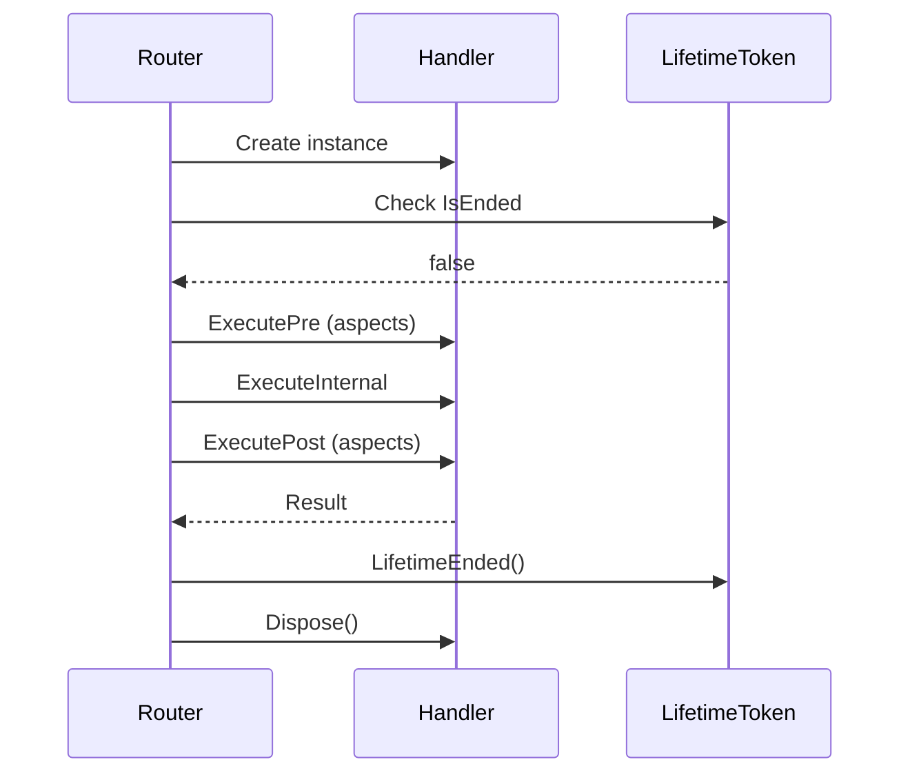

## Overview

Handlers are the core building blocks of your Telegram bot. Each handler processes a specific type of update and contains the business logic for responding to user interactions.

## Handler Base Classes

Telegrator provides several specialized handler base classes for different update types:

<CardGroup cols={2}>
  <Card title="MessageHandler" icon="message">
    Process text messages, photos, videos, and other message types
  </Card>
  <Card title="CommandHandler" icon="terminal">
    Handle bot commands (messages starting with /)
  </Card>
  <Card title="CallbackQueryHandler" icon="hand-pointer">
    Respond to inline keyboard button presses
  </Card>
  <Card title="InlineQueryHandler" icon="magnifying-glass">
    Handle inline queries and chosen inline results
  </Card>
</CardGroup>

## MessageHandler

The `MessageHandler` is used for processing message updates from users.

### Basic Usage

```csharp
using Telegram.Bot.Types;
using Telegram.Bot.Types.Enums;
using Telegrator.Handlers;
using Telegrator.Annotations;

[MessageHandler]
[TextContains("hello")]
public class HelloMessageHandler : MessageHandler
{
    public override async Task<Result> Execute(
        IHandlerContainer<Message> container, 
        CancellationToken cancellation)
    {
        await Reply("Hello! How can I help you today?");
        return Result.Ok();
    }
}
```

### Available Methods

The `MessageHandler` base class provides convenient methods for responding:

#### Reply Method

Replies directly to the received message:

```csharp
protected async Task<Message> Reply(
    string text,
    ParseMode parseMode = ParseMode.None,
    ReplyMarkup? replyMarkup = null,
    LinkPreviewOptions? linkPreviewOptions = null,
    int? messageThreadId = null,
    IEnumerable<MessageEntity>? entities = null,
    bool disableNotification = false,
    bool protectContent = false,
    string? messageEffectId = null,
    string? businessConnectionId = null,
    bool allowPaidBroadcast = false,
    int? directMessageTopicId = null,
    SuggestedPostParameters? suggestedPostParameters = null,
    CancellationToken cancellationToken = default)
```

<Tip>
  Use `Reply()` when you want the message to appear as a direct response to the user's message (shown as "in reply to" in Telegram).
</Tip>

#### Response Method

Sends a message to the chat without replying to a specific message:

```csharp
protected async Task<Message> Response(
    string text,
    ParseMode parseMode = ParseMode.None,
    ReplyParameters? replyParameters = null,
    ReplyMarkup? replyMarkup = null,
    // ... other parameters
    CancellationToken cancellationToken = default)
```

### Example: Echo Bot

```csharp
[MessageHandler]
[HasText] // Only messages with text
public class EchoHandler : MessageHandler
{
    public override async Task<Result> Execute(
        IHandlerContainer<Message> container, 
        CancellationToken cancellation)
    {
        string receivedText = Input.Text ?? "(no text)";
        await Reply($"You said: {receivedText}");
        return Result.Ok();
    }
}
```

## CommandHandler

The `CommandHandler` specializes in processing bot commands.

### Basic Usage

```csharp
using Telegrator.Handlers;
using Telegrator.Annotations;

[CommandHandler]
[CommandAllias("start", "begin")]
public class StartCommandHandler : CommandHandler
{
    public override async Task<Result> Execute(
        IHandlerContainer<Message> container, 
        CancellationToken cancellation)
    {
        await Reply(
            "Welcome to the bot! Type /help for available commands.",
            parseMode: ParseMode.Html);
        
        return Result.Ok();
    }
}
```

### Command Properties

The `CommandHandler` provides access to command-specific data:

```csharp
[CommandHandler]
[CommandAllias("search")]
public class SearchCommandHandler : CommandHandler
{
    public override async Task<Result> Execute(
        IHandlerContainer<Message> container, 
        CancellationToken cancellation)
    {
        // Get the command name (without /)
        string command = ReceivedCommand; // "search"
        
        // Get all arguments as a string
        string argsString = ArgumentsString; // "cat videos funny"
        
        // Get arguments as an array
        string[] args = Arguments; // ["cat", "videos", "funny"]
        
        if (args.Length == 0)
        {
            await Reply("Please provide a search query.");
            return Result.Ok();
        }
        
        await Reply($"Searching for: {argsString}");
        return Result.Ok();
    }
}
```

### Command Argument Parsing

The framework automatically splits command arguments:

```csharp
// User sends: /setname John Doe

[CommandHandler]
[CommandAllias("setname")]
public class SetNameHandler : CommandHandler
{
    public override async Task<Result> Execute(
        IHandlerContainer<Message> container, 
        CancellationToken cancellation)
    {
        // ReceivedCommand = "setname"
        // ArgumentsString = "John Doe"
        // Arguments = ["John", "Doe"]
        
        if (Arguments.Length < 2)
        {
            await Reply("Usage: /setname <firstname> <lastname>");
            return Result.Ok();
        }
        
        string firstName = Arguments[0]; // "John"
        string lastName = Arguments[1];  // "Doe"
        
        await Reply($"Name set to: {firstName} {lastName}");
        return Result.Ok();
    }
}
```

<Note>
  Arguments are split by spaces. If users need to include spaces in a single argument, you'll need to implement your own parsing logic or use quotes.
</Note>

## CallbackQueryHandler

Handles button presses from inline keyboards.

### Basic Usage

```csharp
using Telegram.Bot.Types;
using Telegram.Bot.Types.ReplyMarkups;
using Telegrator.Handlers;
using Telegrator.Annotations;

[CallbackQueryHandler]
[CallbackData("btn_confirm")]
public class ConfirmButtonHandler : CallbackQueryHandler
{
    public override async Task<Result> Execute(
        IHandlerContainer<CallbackQuery> container, 
        CancellationToken cancellation)
    {
        // Answer the callback query (removes loading state)
        await Answer("Confirmed!", showAlert: false);
        
        // Edit the message that contained the button
        await EditMessage("✅ Confirmed!");
        
        return Result.Ok();
    }
}
```

### Available Methods

#### Answer Method

Answers the callback query (required to remove loading state):

```csharp
protected async Task Answer(
    string? text = null,
    bool showAlert = false,
    string? url = null,
    int cacheTime = 0,
    CancellationToken cancellationToken = default)
```

<Warning>
  Always call `Answer()` in your callback query handlers, even if you don't want to show a message. Otherwise, the loading indicator will remain visible to the user.
</Warning>

#### EditMessage Method

Edits the message that triggered the callback:

```csharp
protected async Task<Message> EditMessage(
    string text,
    ParseMode parseMode = ParseMode.None,
    InlineKeyboardMarkup? replyMarkup = null,
    IEnumerable<MessageEntity>? entities = null,
    LinkPreviewOptions? linkPreviewOptions = null,
    CancellationToken cancellationToken = default)
```

### Example: Confirmation Dialog

```csharp
// Handler to send confirmation request
[MessageHandler]
[CommandHandler]
[CommandAllias("delete")]
public class DeleteCommandHandler : CommandHandler
{
    public override async Task<Result> Execute(
        IHandlerContainer<Message> container, 
        CancellationToken cancellation)
    {
        var keyboard = new InlineKeyboardMarkup(new[]
        {
            new[]
            {
                InlineKeyboardButton.WithCallbackData("✅ Confirm", "delete_confirm"),
                InlineKeyboardButton.WithCallbackData("❌ Cancel", "delete_cancel")
            }
        });
        
        await Reply(
            "Are you sure you want to delete your account?",
            replyMarkup: keyboard);
        
        return Result.Ok();
    }
}

// Handler for confirmation button
[CallbackQueryHandler]
[CallbackData("delete_confirm")]
public class DeleteConfirmHandler : CallbackQueryHandler
{
    public override async Task<Result> Execute(
        IHandlerContainer<CallbackQuery> container, 
        CancellationToken cancellation)
    {
        await Answer("Account deleted", showAlert: true);
        await EditMessage("✅ Your account has been deleted.");
        
        // Perform actual deletion logic here
        
        return Result.Ok();
    }
}

// Handler for cancel button
[CallbackQueryHandler]
[CallbackData("delete_cancel")]
public class DeleteCancelHandler : CallbackQueryHandler
{
    public override async Task<Result> Execute(
        IHandlerContainer<CallbackQuery> container, 
        CancellationToken cancellation)
    {
        await Answer();
        await EditMessage("❌ Deletion cancelled.");
        return Result.Ok();
    }
}
```

### TypeData Property

Access callback data through the `TypeData` property:

```csharp
[CallbackQueryHandler]
public class GenericCallbackHandler : CallbackQueryHandler
{
    public override async Task<Result> Execute(
        IHandlerContainer<CallbackQuery> container, 
        CancellationToken cancellation)
    {
        // TypeData contains the callback_data string
        string data = TypeData;
        
        if (data.StartsWith("product_"))
        {
            string productId = data.Substring(8);
            await Answer($"Selected product: {productId}");
        }
        
        return Result.Ok();
    }
}
```

## InlineQueryHandler

Handles inline queries and chosen inline results.

### Basic Usage

```csharp
using Telegram.Bot.Types;
using Telegram.Bot.Types.InlineQueryResults;
using Telegrator.Handlers;

[InlineQueryHandler]
public class SearchInlineHandler : InlineQueryHandler
{
    public override async Task<Result> Requested(
        IHandlerContainer<InlineQuery> container, 
        CancellationToken cancellation)
    {
        string query = InputQuery.Query;
        
        var results = new List<InlineQueryResult>
        {
            new InlineQueryResultArticle(
                id: "1",
                title: $"Search for: {query}",
                inputMessageContent: new InputTextMessageContent(query))
        };
        
        await Answer(results, cacheTime: 300);
        return Result.Ok();
    }
    
    public override async Task<Result> Chosen(
        IHandlerContainer<ChosenInlineResult> container, 
        CancellationToken cancellation)
    {
        // Handle when user selects an inline result
        string resultId = InputChosen.ResultId;
        // Log or track the selection
        return Result.Ok();
    }
}
```

<Note>
  `InlineQueryHandler` requires implementing two methods: `Requested()` for handling the query, and `Chosen()` for when the user selects a result.
</Note>

### Answer Method

```csharp
protected async Task Answer(
    IEnumerable<InlineQueryResult> results,
    int? cacheTime = null,
    bool isPersonal = false,
    string? nextOffset = null,
    InlineQueryResultsButton? button = null,
    CancellationToken cancellationToken = default)
```

## Branching Handlers

Branching handlers allow multiple execution paths within a single handler.

### BranchingMessageHandler

```csharp
public abstract class BranchingMessageHandler : BranchingUpdateHandler<Message>
{
    // Similar to MessageHandler but for branching scenarios
}
```

### BranchingCommandHandler

```csharp
public abstract class BranchingCommandHandler : BranchingMessageHandler
{
    // Similar to CommandHandler but for branching scenarios
}
```

<Tip>
  Use branching handlers when you need to implement complex conditional logic or multiple response paths within a single handler class.
</Tip>

## Handler Lifecycle

Handlers follow a specific lifecycle managed by the framework:



### LifetimeToken

Each handler has a `LifetimeToken` that tracks its lifecycle:

```csharp
public HandlerLifetimeToken LifetimeToken { get; }
```

<Warning>
  Do not reuse handler instances. Each update should be processed by a fresh handler instance to avoid state contamination.
</Warning>

## Best Practices

<AccordionGroup>
  <Accordion title="Keep Handlers Focused" icon="bullseye">
    Each handler should do one thing well. If you need complex logic, split it into multiple handlers:

    ```csharp
    // Good: Focused handler
    [CommandHandler]
    [CommandAllias("start")]
    public class StartHandler : CommandHandler { }
    
    // Bad: Handler trying to do too much
    [CommandHandler]
    [CommandAllias("start", "help", "about", "settings")]
    public class MultiPurposeHandler : CommandHandler { }
    ```
  </Accordion>

  <Accordion title="Use Dependency Injection" icon="plug">
    Inject services through constructors:

    ```csharp
    [CommandHandler]
    [CommandAllias("stats")]
    public class StatsHandler : CommandHandler
    {
        private readonly IUserService _userService;
        
        public StatsHandler(IUserService userService)
        {
            _userService = userService;
        }
        
        public override async Task<Result> Execute(
            IHandlerContainer<Message> container, 
            CancellationToken cancellation)
        {
            var stats = await _userService.GetStatsAsync();
            await Reply($"Total users: {stats.TotalUsers}");
            return Result.Ok();
        }
    }
    ```
  </Accordion>

  <Accordion title="Handle Errors Gracefully" icon="shield-check">
    Use try-catch blocks to handle exceptions:

    ```csharp
    public override async Task<Result> Execute(
        IHandlerContainer<Message> container, 
        CancellationToken cancellation)
    {
        try
        {
            await PerformOperation();
            return Result.Ok();
        }
        catch (Exception ex)
        {
            await Reply("Sorry, an error occurred. Please try again.");
            // Log the exception
            return Result.Fault();
        }
    }
    ```
  </Accordion>

  <Accordion title="Always Answer Callback Queries" icon="hand">
    Even if you don't want to show a message, call `Answer()`:

    ```csharp
    // Good
    await Answer(); // Removes loading indicator
    
    // Bad - loading indicator stays visible
    // (no Answer() call)
    ```
  </Accordion>
</AccordionGroup>

## Related Topics

<CardGroup cols={2}>
  <Card title="Filters" icon="filter" href="/core-concepts/filters">
    Learn how to filter updates with attributes
  </Card>
  <Card title="Results" icon="flag-checkered" href="/core-concepts/results">
    Understand handler return values
  </Card>
  <Card title="State Management" icon="database" href="/core-concepts/state-management">
    Track conversation state across updates
  </Card>
  <Card title="Architecture" icon="sitemap" href="/core-concepts/architecture">
    Understand the overall framework design
  </Card>
</CardGroup>