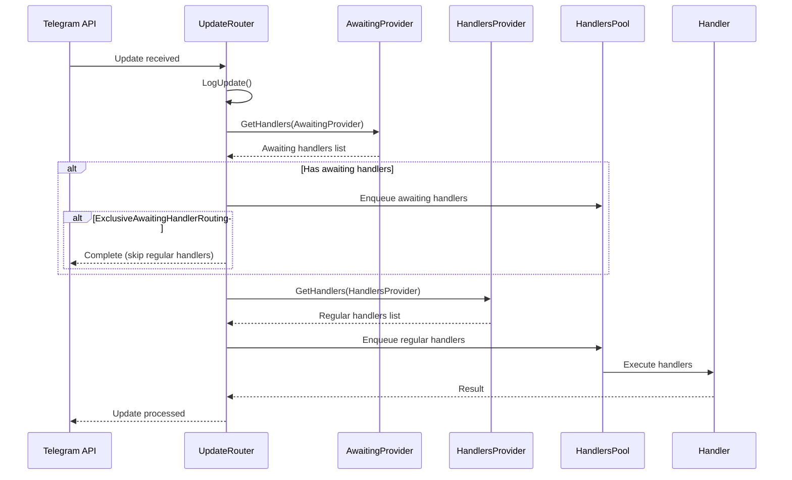

## Overview

Telegrator implements the **Mediator Pattern** through its `UpdateRouter` component. This design pattern centralizes complex update distribution logic, reducing coupling between components and making the system easier to understand and maintain.

## The UpdateRouter

The `UpdateRouter` is the central mediator that coordinates the flow of Telegram updates to appropriate handlers.

### Core Responsibilities

<CardGroup cols={2}>
  <Card title="Update Reception" icon="inbox">
    Receives updates from Telegram Bot API via polling or webhooks
  </Card>
  <Card title="Handler Discovery" icon="magnifying-glass">
    Finds matching handlers based on update type and filters
  </Card>
  <Card title="Priority Management" icon="list-ol">
    Manages handler execution order based on importance
  </Card>
  <Card title="Exception Handling" icon="triangle-exclamation">
    Routes exceptions to appropriate exception handlers
  </Card>
</CardGroup>

### Interface Definition

```csharp
public interface IUpdateRouter : IUpdateHandler, IPollingProvider
{   
    /// <summary>
    /// Gets the TelegratorOptions for the router.
    /// </summary>
    public TelegratorOptions Options { get; }
    
    /// <summary>
    /// Gets the IUpdateHandlersPool that manages handler execution.
    /// </summary>
    public IUpdateHandlersPool HandlersPool { get; }
    
    /// <summary>
    /// Gets or sets the IRouterExceptionHandler for handling exceptions.
    /// </summary>
    public IRouterExceptionHandler? ExceptionHandler { get; set; }
    
    /// <summary>
    /// Default handler container factory
    /// </summary>
    public IHandlerContainerFactory? DefaultContainerFactory { get; set; }
}
```

## Update Distribution Flow

The router follows a sophisticated dispatch mechanism to ensure updates reach the right handlers.



## Handler Providers

The router uses two types of providers to locate handlers:

### HandlersProvider

Manages regular handlers registered for various update types.

```csharp
public interface IHandlersProvider
{
    bool TryGetDescriptorList(UpdateType type, out HandlerDescriptorList? descriptors);
    UpdateHandlerBase GetHandlerInstance(HandlerDescriptor descriptor, 
        CancellationToken cancellationToken);
}
```

<Tip>
  Regular handlers are the primary handlers for processing updates. They're registered at startup and remain available throughout the bot's lifetime.
</Tip>

### AwaitingProvider

Manages temporary handlers waiting for specific user responses.

```csharp
public interface IAwaitingProvider : IHandlersProvider
{
    // Inherits from IHandlersProvider
    // Provides handlers that are waiting for specific updates
}
```

<Note>
  Awaiting handlers are checked **before** regular handlers, allowing you to temporarily override default behavior for specific users or conversations.
</Note>

## Handler Discovery Process

The router uses a multi-step process to find matching handlers:

### Step 1: Query by Update Type

```csharp
protected virtual IEnumerable<DescribedHandlerInfo> GetHandlers(
    IHandlersProvider provider, 
    ITelegramBotClient client, 
    Update update, 
    CancellationToken cancellationToken = default)
{
    Alligator.LogTrace("Requested handlers for UpdateType.{0}", update.Type);
    
    if (!provider.TryGetDescriptorList(update.Type, out HandlerDescriptorList? descriptors))
    {
        Alligator.LogTrace("No registered, providing Any");
        provider.TryGetDescriptorList(UpdateType.Unknown, out descriptors);
    }
    
    if (descriptors == null || descriptors.Count == 0)
    {
        Alligator.LogTrace("No handlers provided");
        return [];
    }
    
    return DescribeDescriptors(provider, descriptors, client, update, cancellationToken);
}
```

<Warning>
  If no handlers are registered for a specific update type, the router falls back to `UpdateType.Unknown` handlers. If you want to handle all update types, register your handler with `UpdateType.Unknown`.
</Warning>

### Step 2: Describe Descriptors

Processes handler descriptors in reverse order (last registered = highest priority).

```csharp
protected virtual IEnumerable<DescribedHandlerInfo> DescribeDescriptors(
    IHandlersProvider provider, 
    HandlerDescriptorList descriptors, 
    ITelegramBotClient client, 
    Update update, 
    CancellationToken cancellationToken = default)
{
    Alligator.LogTrace(
        "Describing descriptors of descriptorsList.HandlingType.{0} for Update ({1})", 
        descriptors.HandlingType, update.Id);
    
    foreach (HandlerDescriptor descriptor in descriptors.Reverse())
    {
        cancellationToken.ThrowIfCancellationRequested();
        
        DescribedHandlerInfo? describedHandler = DescribeHandler(
            provider, descriptor, client, update, 
            out bool breakRouting, cancellationToken);
        
        if (breakRouting)
            yield break;
        
        if (describedHandler == null)
            continue;
        
        yield return describedHandler;
    }
}
```

### Step 3: Validate Filters

Each handler's filters are validated before execution.

```csharp
public virtual DescribedHandlerInfo? DescribeHandler(
    IHandlersProvider provider, 
    HandlerDescriptor descriptor, 
    ITelegramBotClient client, 
    Update update, 
    out bool breakRouting, 
    CancellationToken cancellationToken = default)
{
    breakRouting = false;
    cancellationToken.ThrowIfCancellationRequested();
    
    UpdateHandlerBase handlerInstance = provider.GetHandlerInstance(
        descriptor, cancellationToken);
    
    FilterExecutionContext<Update> filterContext = 
        new FilterExecutionContext<Update>(_botInfo, update, update, data, []);
    
    if (descriptor.Filters != null)
    {
        FiltersFallbackReport report = new FiltersFallbackReport(descriptor, filterContext);
        Result filtersResult = descriptor.Filters.Validate(
            filterContext, descriptor.FormReport, ref report);
        
        if (filtersResult.RouteNext)
        {
            Result fallbackResult = handlerInstance.FiltersFallback(
                report, client, cancellationToken).Result;
            breakRouting = !fallbackResult.RouteNext;
            return null;
        }
        else if (!filtersResult.Positive)
        {
            return null;
        }
    }
    
    return new DescribedHandlerInfo(
        descriptor, this, AwaitingProvider, 
        client, handlerInstance, filterContext, descriptor.DisplayString);
}
```

## Handler Execution Pool

The `UpdateHandlersPool` manages concurrent handler execution based on configuration.

### Concurrency Control

```csharp
public class TelegratorOptions
{
    /// <summary>
    /// Maximum number of handlers that can execute in parallel.
    /// Null means unlimited concurrency.
    /// </summary>
    public int? MaximumParallelWorkingHandlers { get; set; }
}
```

<Tip>
  Set `MaximumParallelWorkingHandlers` to control resource usage. A value of `1` ensures sequential processing, while `null` allows unlimited concurrency.
</Tip>

### Queue Management

Handlers are enqueued and executed based on the pool's capacity:

```csharp
await HandlersPool.Enqueue(handlers);
```

## Routing Modes

### Exclusive Awaiting Handler Routing

When enabled, awaiting handlers block regular handlers from executing:

```csharp
if (handlers.Any())
{
    await HandlersPool.Enqueue(handlers);
    
    // Check if awaiting handlers have exclusive routing
    if (Options.ExclusiveAwaitingHandlerRouting)
    {
        Alligator.LogTrace(
            "Receiving Update ({0}) completed with only awaiting handlers", 
            update.Id);
        return;
    }
}
```

<Note>
  This is useful for implementing conversation flows where you want to temporarily override default behavior while waiting for user input.
</Note>

## Exception Handling

The router provides centralized exception handling through the `IRouterExceptionHandler` interface.

```csharp
public virtual Task HandleErrorAsync(
    ITelegramBotClient botClient, 
    Exception exception, 
    HandleErrorSource source, 
    CancellationToken cancellationToken)
{
    Alligator.LogDebug("Handling exception {0}", exception.GetType().Name);
    ExceptionHandler?.HandleException(botClient, exception, source, cancellationToken);
    return Task.CompletedTask;
}
```

### Exception Sources

- `HandleErrorSource.PollingError` - Errors during update polling
- `HandleErrorSource.HandleUpdateError` - Errors during handler execution

## Handler Lifetime Management

The router manages handler lifecycles through `HandlerLifetimeToken`:

```csharp
public class HandlerLifetimeToken
{
    public bool IsEnded { get; private set; }
    
    public void LifetimeEnded()
    {
        IsEnded = true;
    }
}
```

Handlers are automatically disposed after execution completes.

## Best Practices

<AccordionGroup>
  <Accordion title="Use Awaiting Handlers for Conversations" icon="comments">
    When building conversational flows, use awaiting handlers to temporarily intercept updates for specific users:

    ```csharp
    // Register an awaiting handler for a specific user
    await awaitingProvider.RegisterHandler(userId, handler);
    ```
  </Accordion>

  <Accordion title="Configure Concurrency Appropriately" icon="sliders">
    Balance responsiveness and resource usage:

    - **High traffic bots**: Set a reasonable limit (e.g., 10-50)
    - **Low traffic bots**: Use unlimited concurrency
    - **Resource-intensive handlers**: Use lower limits
  </Accordion>

  <Accordion title="Handle Exceptions Gracefully" icon="shield">
    Implement a custom exception handler to log errors and notify administrators:

    ```csharp
    router.ExceptionHandler = new CustomExceptionHandler();
    ```
  </Accordion>

  <Accordion title="Use Appropriate Result Types" icon="check">
    Return the correct `Result` type to control routing:

    - `Result.Ok()` when the handler fully processed the update
    - `Result.Next()` when other handlers should also process it
    - `Result.Fault()` on errors that should stop routing
  </Accordion>
</AccordionGroup>

## Related Topics

<CardGroup cols={2}>
  <Card title="Architecture" icon="sitemap" href="/core-concepts/architecture">
    Learn about the overall framework architecture
  </Card>
  <Card title="Handlers" icon="code" href="/core-concepts/handlers">
    Explore different handler types
  </Card>
  <Card title="Results" icon="flag-checkered" href="/core-concepts/results">
    Master handler result types
  </Card>
  <Card title="Filters" icon="filter" href="/core-concepts/filters">
    Understand the filter validation system
  </Card>
</CardGroup>