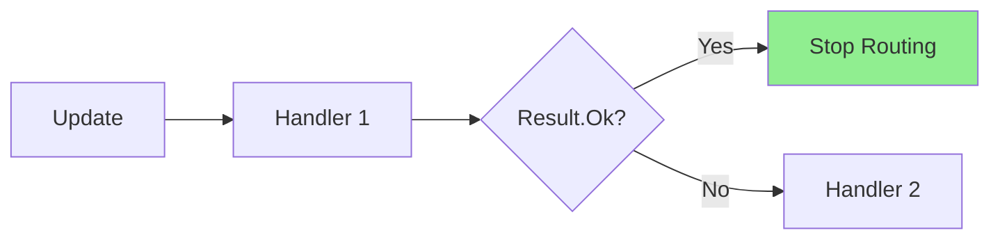
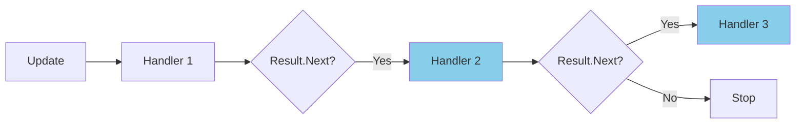
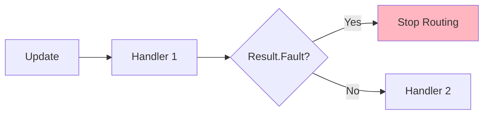
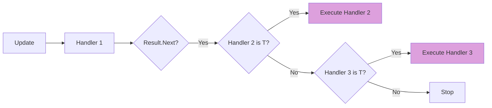
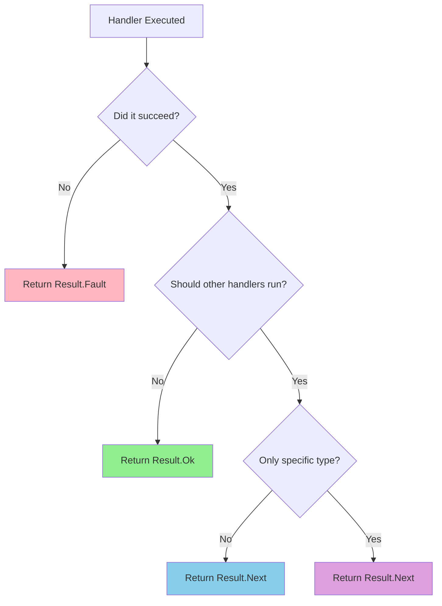

## Overview

The `Result` class is how handlers communicate with the router. Results control whether routing continues, stops, or branches, giving you fine-grained control over update processing.

## The Result Class

```csharp
public sealed class Result
{
    /// <summary>
    /// Is result positive
    /// </summary>
    public bool Positive { get; }
    
    /// <summary>
    /// Should router search for next matching handler
    /// </summary>
    public bool RouteNext { get; }
    
    /// <summary>
    /// Exact type that router should search
    /// </summary>
    public Type? NextType { get; }
}
```

## Result Types

Telegrator provides four primary result types:

<CardGroup cols={2}>
  <Card title="Result.Ok()" icon="check">
    Success - stop routing and mark as handled
  </Card>
  <Card title="Result.Next()" icon="forward">
    Continue - let other handlers process too
  </Card>
  <Card title="Result.Fault()" icon="xmark">
    Error - stop routing due to failure
  </Card>
  <Card title="Result.Next<T>()" icon="code-branch">
    Chain - continue only with specific type
  </Card>
</CardGroup>

## Result.Ok()

Indicates successful handler execution and stops the routing chain.

### When to Use

Use `Result.Ok()` when:
- The handler fully processed the update
- No other handlers should execute
- The operation completed successfully

### Example

```csharp
using Telegram.Bot.Types;
using Telegrator.Handlers;
using Telegrator.Annotations;

[CommandHandler]
[CommandAllias("start")]
public class StartCommandHandler : CommandHandler
{
    public override async Task<Result> Execute(
        IHandlerContainer<Message> container, 
        CancellationToken cancellation)
    {
        await Reply("Welcome to the bot!");
        
        // Update fully handled, stop routing
        return Result.Ok();
    }
}
```

### Behavior



<Note>
  `Result.Ok()` is the most common return value. Use it whenever your handler successfully processes the update and no further handling is needed.
</Note>

## Result.Next()

Indicates the handler processed the update but other handlers should also execute.

### When to Use

Use `Result.Next()` when:
- You want to log or track updates
- Multiple handlers should process the same update
- Implementing middleware-style behavior
- The handler performed a partial operation

### Example: Logging Handler

```csharp
[MessageHandler]
[HasText]
public class LoggingHandler : MessageHandler
{
    private readonly ILogger<LoggingHandler> _logger;
    
    public LoggingHandler(ILogger<LoggingHandler> logger)
    {
        _logger = logger;
    }
    
    public override async Task<Result> Execute(
        IHandlerContainer<Message> container, 
        CancellationToken cancellation)
    {
        // Log the message
        _logger.LogInformation(
            "User {UserId} sent: {Text}",
            Input.From?.Id,
            Input.Text);
        
        // Let other handlers process the message
        return Result.Next();
    }
}

[MessageHandler]
[TextEquals("hello")]
public class HelloHandler : MessageHandler
{
    public override async Task<Result> Execute(
        IHandlerContainer<Message> container, 
        CancellationToken cancellation)
    {
        // This will execute after LoggingHandler
        await Reply("Hello!");
        return Result.Ok();
    }
}
```

### Behavior



<Tip>
  Use `Result.Next()` for implementing cross-cutting concerns like logging, analytics, or rate limiting that shouldn't interfere with normal handler execution.
</Tip>

## Result.Fault()

Indicates an error occurred and routing should stop.

### When to Use

Use `Result.Fault()` when:
- An error occurred that can't be recovered
- The update shouldn't be processed further
- You want to signal failure to the router
- Validation failed critically

### Example: Validation Handler

```csharp
[MessageHandler]
[CommandHandler]
[CommandAllias("admin")]
public class AdminCommandHandler : CommandHandler
{
    private readonly IUserService _userService;
    
    public AdminCommandHandler(IUserService userService)
    {
        _userService = userService;
    }
    
    public override async Task<Result> Execute(
        IHandlerContainer<Message> container, 
        CancellationToken cancellation)
    {
        long userId = Input.From?.Id ?? 0;
        
        // Check if user is admin
        if (!await _userService.IsAdminAsync(userId))
        {
            await Reply("⚠️ You don't have permission for this command.");
            
            // Stop routing - unauthorized access
            return Result.Fault();
        }
        
        // User is admin, execute command
        await Reply("⚙️ Admin panel loading...");
        return Result.Ok();
    }
}
```

### Example: Error Handling

```csharp
[MessageHandler]
[TextStartsWith("/calculate")]
public class CalculatorHandler : MessageHandler
{
    public override async Task<Result> Execute(
        IHandlerContainer<Message> container, 
        CancellationToken cancellation)
    {
        try
        {
            // Parse and calculate
            string expression = Input.Text.Substring(11);
            double result = Calculate(expression);
            
            await Reply($"Result: {result}");
            return Result.Ok();
        }
        catch (Exception ex)
        {
            await Reply($"❌ Error: {ex.Message}");
            
            // Signal error to router
            return Result.Fault();
        }
    }
    
    private double Calculate(string expression)
    {
        // Calculation logic...
        throw new NotImplementedException();
    }
}
```

### Behavior



<Warning>
  `Result.Fault()` stops the routing chain. Use it carefully, as it prevents other handlers from processing the update.
</Warning>

## Result.Next&lt;T&gt;()

Indicates routing should continue but only with handlers of a specific type.

### When to Use

Use `Result.Next<T>()` when:
- Implementing handler chains
- Building pipeline processing
- Creating handler hierarchies
- You want type-specific routing

### Example: Handler Chain

```csharp
// Base processing handler
[MessageHandler]
[TextStartsWith("/process")]
public class ProcessStartHandler : MessageHandler
{
    public override async Task<Result> Execute(
        IHandlerContainer<Message> container, 
        CancellationToken cancellation)
    {
        // Initial processing
        await Reply("🔄 Processing started...");
        
        // Continue only with ProcessingStepHandler types
        return Result.Next<ProcessingStepHandler>();
    }
}

// Step 1
[MessageHandler]
public class ValidationStepHandler : ProcessingStepHandler
{
    public override async Task<Result> Execute(
        IHandlerContainer<Message> container, 
        CancellationToken cancellation)
    {
        // Validation logic
        await Reply("✅ Validation complete");
        
        // Continue with next ProcessingStepHandler
        return Result.Next<ProcessingStepHandler>();
    }
}

// Step 2
[MessageHandler]
public class TransformationStepHandler : ProcessingStepHandler
{
    public override async Task<Result> Execute(
        IHandlerContainer<Message> container, 
        CancellationToken cancellation)
    {
        // Transformation logic
        await Reply("🔄 Transformation complete");
        
        // Continue with next ProcessingStepHandler
        return Result.Next<ProcessingStepHandler>();
    }
}

// Final step
[MessageHandler]
public class FinalizationStepHandler : ProcessingStepHandler
{
    public override async Task<Result> Execute(
        IHandlerContainer<Message> container, 
        CancellationToken cancellation)
    {
        // Finalization logic
        await Reply("✅ Processing complete!");
        
        // Stop the chain
        return Result.Ok();
    }
}

// Base class for processing steps
public abstract class ProcessingStepHandler : MessageHandler
{
}
```

### Behavior



<Tip>
  `Result.Next<T>()` is useful for creating processing pipelines where you want to execute multiple related handlers in sequence.
</Tip>

## Results in Different Contexts

### In Handler Execute Method

```csharp
public override async Task<Result> Execute(
    IHandlerContainer<Message> container, 
    CancellationToken cancellation)
{
    // Result.Ok() - Handler succeeded, stop routing
    // Result.Next() - Handler succeeded, continue routing
    // Result.Fault() - Handler failed, stop routing
    // Result.Next<T>() - Continue with type T handlers only
    
    return Result.Ok();
}
```

### In FiltersFallback

When filters fail, you can control routing in the fallback:

```csharp
public override async Task<Result> FiltersFallback(
    FiltersFallbackReport report, 
    ITelegramBotClient client, 
    CancellationToken cancellationToken = default)
{
    // Result.Next() - Silently continue to next handler
    // Result.Fault() - Stop routing (reject update)
    
    // Send error message and continue
    await client.SendTextMessageAsync(
        chatId: report.Context.Update.Message.Chat.Id,
        text: "Filter validation failed",
        cancellationToken: cancellationToken);
    
    return Result.Next(); // Let other handlers try
}
```

### In Aspects (Pre/Post Processors)

```csharp
public class LoggingPreProcessor : IPreProcessor
{
    public async Task<Result> PreProcess(
        UpdateHandlerBase handler,
        IHandlerContainer container,
        CancellationToken cancellationToken)
    {
        // Log before execution
        
        // Result.Ok() - Let handler execute
        // Result.Fault() - Prevent handler execution
        
        return Result.Ok();
    }
}
```

## Decision Tree

Use this tree to decide which result to return:



## Common Patterns

### Pattern 1: Simple Command

Most commands return `Result.Ok()`:

```csharp
[CommandHandler]
[CommandAllias("help")]
public class HelpHandler : CommandHandler
{
    public override async Task<Result> Execute(
        IHandlerContainer<Message> container, 
        CancellationToken cancellation)
    {
        await Reply("Help message...");
        return Result.Ok(); // Done, no other handlers needed
    }
}
```

### Pattern 2: Middleware/Logging

Logging handlers return `Result.Next()`:

```csharp
[MessageHandler]
public class AnalyticsHandler : MessageHandler
{
    public override async Task<Result> Execute(
        IHandlerContainer<Message> container, 
        CancellationToken cancellation)
    {
        // Track analytics
        await TrackEvent("message_received", Input.From?.Id);
        
        return Result.Next(); // Let other handlers process
    }
}
```

### Pattern 3: Validation

Validation handlers return `Result.Fault()` on failure:

```csharp
[MessageHandler]
public class RateLimitHandler : MessageHandler
{
    public override async Task<Result> Execute(
        IHandlerContainer<Message> container, 
        CancellationToken cancellation)
    {
        if (await IsRateLimited(Input.From?.Id))
        {
            await Reply("⏱️ Too many requests. Please wait.");
            return Result.Fault(); // Block further processing
        }
        
        return Result.Next(); // Pass to next handler
    }
}
```

### Pattern 4: Pipeline Processing

Pipeline handlers use `Result.Next<T>()`:

```csharp
[MessageHandler]
public class PipelineStarter : MessageHandler
{
    public override async Task<Result> Execute(
        IHandlerContainer<Message> container, 
        CancellationToken cancellation)
    {
        // Start pipeline
        return Result.Next<PipelineStep>();
    }
}
```

## Best Practices

<AccordionGroup>
  <Accordion title="Be Explicit About Intent" icon="bullseye">
    Choose the result that clearly expresses what should happen:

    ```csharp
    // Good: Clear intent
    await Reply("Done!");
    return Result.Ok(); // We're done
    
    // Bad: Unclear intent
    await Reply("Done!");
    return Result.Next(); // Why continue if we're done?
    ```
  </Accordion>

  <Accordion title="Handle Errors Appropriately" icon="shield">
    Use `Result.Fault()` for errors that should stop processing:

    ```csharp
    try
    {
        await PerformOperation();
        return Result.Ok();
    }
    catch (Exception ex)
    {
        _logger.LogError(ex, "Operation failed");
        await Reply("An error occurred");
        return Result.Fault(); // Don't let other handlers try
    }
    ```
  </Accordion>

  <Accordion title="Use Next() for Cross-Cutting Concerns" icon="layer-group">
    Logging, analytics, and monitoring should use `Result.Next()`:

    ```csharp
    // Logging handler
    _logger.LogInformation("Processing update");
    return Result.Next(); // Don't block other handlers
    
    // Analytics handler
    await TrackEvent("user_action");
    return Result.Next(); // Let normal handlers run
    ```
  </Accordion>

  <Accordion title="Document Pipeline Chains" icon="book">
    When using `Result.Next<T>()`, document the chain:

    ```csharp
    /// <summary>
    /// Order processing pipeline:
    /// 1. OrderValidationHandler
    /// 2. OrderPricingHandler
    /// 3. OrderConfirmationHandler
    /// </summary>
    [MessageHandler]
    public class OrderPipelineStarter : MessageHandler
    {
        public override async Task<Result> Execute(...)
        {
            return Result.Next<OrderPipelineHandler>();
        }
    }
    ```
  </Accordion>
</AccordionGroup>

## Result Matrix

| Result | Positive | RouteNext | NextType | Use Case |
|--------|----------|-----------|----------|----------|
| `Ok()` | ✅ True | ❌ False | null | Handler succeeded, stop routing |
| `Next()` | ✅ True | ✅ True | null | Handler succeeded, continue routing |
| `Fault()` | ❌ False | ❌ False | null | Handler failed, stop routing |
| `Next<T>()` | ✅ True | ✅ True | Type T | Handler succeeded, route to type T |

## Related Topics

<CardGroup cols={2}>
  <Card title="Handlers" icon="code" href="/core-concepts/handlers">
    Learn about implementing handlers
  </Card>
  <Card title="Mediator Pattern" icon="shuffle" href="/core-concepts/mediator-pattern">
    Understand the routing mechanism
  </Card>
  <Card title="Filters" icon="filter" href="/core-concepts/filters">
    Master filter validation and fallbacks
  </Card>
  <Card title="Architecture" icon="sitemap" href="/core-concepts/architecture">
    See how results fit in the framework
  </Card>
</CardGroup>